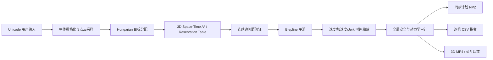

# 集中式空中字符编队调度架构

## 目标

用户给出类似 `2026-龙-马-精-神` 的序列。系统在起飞前一次性计算所有无人机的身份、目标、无碰路径、平滑轨迹和灯光，并输出统一时间轴下的逐机指令。飞行期间不重新运行 MAPF；执行层只跟踪已批准的参考轨迹。

## 算法层

1. **Formation synthesis**：Pillow 使用 Unicode 字体把每个展示片段栅格化；加权最远点采样产生恰好 N 个唯一整数网格目标。
2. **Target assignment**：SciPy Hungarian algorithm 最小化当前编队到下一编队的总欧氏位移，保持一机一目标。
3. **MAPF**：集中式 prioritized space-time A*。预留表同时阻止同一时刻占据同一格、迎面对穿，以及一个时间步内两条连续边距离低于阈值。已经位于目标的无人机先锁定目标，其余长路径再绕行。
4. **Trajectory generation**：离散路径先进行安全感知高斯/B-spline 平滑；若平滑破坏间距则降低平滑量或回退线性路径。
5. **Dynamic optimization**：统一放大时间轴，直到数值速度、加速度和 jerk 均低于配置上限；之后以固定采样率导出。
6. **Audit**：在完整同步时间轴上重新计算全局最小机间距、最大速度和最大加速度。任何阈值失败都会中止导出。

## 软件模块

- `formations.py`：序列解析、中文字体、字符目标、起飞网格。
- `assignment.py`：目标分配。
- `mapf.py`：3D 时空 A*、预留表、离散路径验证。
- `trajectory.py`：连续安全检查、平滑、动力学时间缩放。
- `planner.py`：五个阶段的集中式编排和全局时间轴。
- `export.py`：NPZ、manifest 和逐机 CSV 编码。
- `visualize.py`：64 机 3D 动画。
- `cli.py`：用户入口和既有计划复用。

## 当前 64 机演示结果

- 序列：`2026 → 龙 → 马 → 精 → 神`
- 真实计划时长：187.8 s
- 全局最小间距：0.32184 m（配置阈值 0.32 m）
- 最大速度：0.5224 m/s
- 最大加速度：2.6152 m/s²
- 五次 MAPF 均成功；首段规模最大，为 44 个离散时间步和 97,586 个 A* 扩展节点。

## 到真机还缺什么

调度器只负责全局参考轨迹。生产系统仍需：

- 每机 SE(3)/MPC 轨迹跟踪器和电机混控；
- GPS-RTK/UWB/Vicon 定位与 PTP/PPS 级时钟同步；
- 跟踪误差管道和基于误差界膨胀后的安全走廊；
- 通信、低电量、定位漂移、单机失效的在线监控与统一 abort；
- 起降区、观众区、地理围栏、气象限制和当地监管批准；
- 硬件在环、逐步增机和受控场地验证。

因此当前输出适合算法研究、调度验证和 RotorPy/其他仿真器接入，不应未经上述工程化直接用于公共场地飞行。
