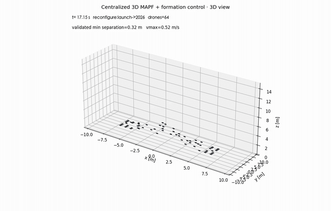

# RotorPy Agilicious · 无人机编队仿真

基于 RotorPy 的无人机动力学、强化学习和集中式编队演出项目。支持中文字符编队、三维路径规划、四旋翼可视化，以及逐机指令导出。

[](https://raw.githubusercontent.com/WYS08HFUT/drone_show/main/outputs/2026_dragon_horse_spirit/show.mp4)

▶️ **点击上方动态预览播放完整视频** · [直接打开 H.264 MP4](https://raw.githubusercontent.com/WYS08HFUT/drone_show/main/outputs/2026_dragon_horse_spirit/show.mp4)

## 功能概览

| 模块 | 能力 |
| --- | --- |
| 单机控制 | Agilicious / NeuroBEM Kingfisher 参数映射、PPO CTBR 悬停策略 |
| 编队规划 | 匈牙利目标分配、连续安全约束的 3D 时空 A*、轨迹平滑与动力学时间缩放 |
| 字符演出 | Unicode / 中文字符采样，多段编队和熄灯重排 |
| 三维回放 | 透视、正视、俯视相机；点模型或带机臂和四旋翼的无人机模型 |
| 数据输出 | MP4、压缩计划、验证清单，以及每架无人机独立的 CSV 指令流 |

更详细的系统边界与模块关系见 [ARCHITECTURE.md](ARCHITECTURE.md)。

## 快速开始

要求 Python 3.11+、FFmpeg，以及可用的 Conda 环境。RotorPy 是 Python 包，不需要编译 C++。

```bash
cd /Users/wang/Desktop/drone_show
conda activate work
python -m pip install -e .
```

生成默认的 64 机演出：

```bash
python -m rotorpy_agilicious.swarm_show \
  --text '2026-龙-马-精-神' \
  --drones 64 \
  --output outputs/my_show
```

首次运行会完成 MAPF 规划并生成视频。之后可以复用计划，省去规划时间：

```bash
python -m rotorpy_agilicious.swarm_show \
  --output outputs/my_show \
  --reuse-plan --show
```

`-` 表示熄灯并进入下一次重排。

## 切换三维视角

轨迹本来就是三维的。旧版默认相机几乎正对字符编队平面，所以画面容易显得像二维。现在默认使用透视三维相机，并提供三种预设：

```bash
# 透视三维（默认，最容易看出深度和高度变化）
python -m rotorpy_agilicious.swarm_show --output outputs/my_show \
  --reuse-plan --show --view 3d

# 正面观看字符队形
python -m rotorpy_agilicious.swarm_show --output outputs/my_show \
  --reuse-plan --show --view front

# 从空中俯视运动轨迹
python -m rotorpy_agilicious.swarm_show --output outputs/my_show \
  --reuse-plan --show --view top
```

交互窗口中还可以直接按住鼠标拖动旋转，滚轮缩放。

## 无人机外观

默认渲染轻量四旋翼模型，包括十字机臂、机身中心和四个旋翼环。若机器性能有限，可以切回点模型：

```bash
# 带旋翼的四旋翼模型（默认）
python -m rotorpy_agilicious.swarm_show --output outputs/my_show \
  --reuse-plan --show --drone-model quadcopter

# 高性能点模型
python -m rotorpy_agilicious.swarm_show --output outputs/my_show \
  --reuse-plan --show --drone-model point
```

当前四旋翼是为 64 机实时预览设计的程序化简模。若需要照片级画面，建议保留本项目的规划与 CSV 导出，再用 Blender、Unity 或 Unreal Engine 导入轨迹和高精度机模进行离线渲染。

## 输出文件

每次演出输出到指定目录：

```text
outputs/my_show/
├── show.mp4                    # 加速三维回放
├── show_plan.npz               # 全部无人机的同步参考轨迹
├── manifest.json               # 坐标系、约束、指标和安全警告
└── drone_commands/
    ├── drone_000.csv           # t / p / v / a / yaw / RGB / phase
    └── ...
```

只打开交互窗口、不重新生成视频：

```bash
python -m rotorpy_agilicious.swarm_show --output outputs/my_show \
  --reuse-plan --no-video --show
```

## RotorPy 单机强化学习

回放已训练的 PPO 策略：

```bash
python -m rotorpy_agilicious.play --wind-x 1.0
```

重新训练：

```bash
python -m rotorpy_agilicious.train --timesteps 1500000 --num-envs 32
```

已有示例位于 [`artifacts/ppo_hover_wind.mp4`](artifacts/ppo_hover_wind.mp4)。

## 仿真边界

本项目是仿真与离线调度原型，不是可直接上传真机的认证飞控。CSV 只提供平台无关的参考指令。真实飞行还需要高精度定位与时钟同步、轨迹跟踪控制器、通信丢包处理、地理围栏、冗余健康监控、失效返航或降落、法规审批，以及更大的鲁棒安全裕度。
